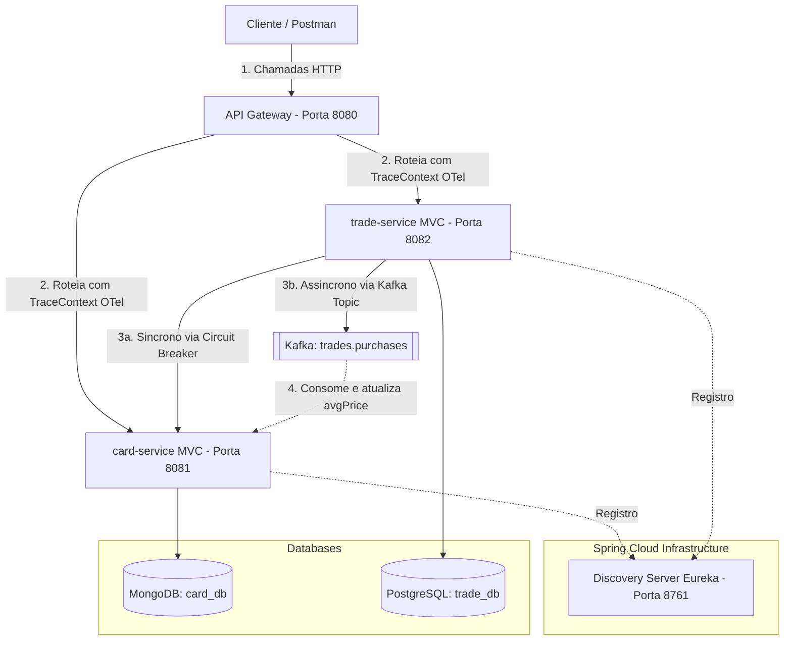

# DeckDealer Marketplace — Microsserviços

Sistema de marketplace especializado na compra e venda de cartas colecionáveis (como *Magic: The Gathering*, *Pokémon TCG* e *Yu-Gi-Oh!*), baseado em microsserviços.

## Integrantes e divisão de responsabilidades

| Integrante | Microsserviço sob responsabilidade | Banco | Papéis Adicionais |
|---|---|---|---|
| **Samuel Barbosa Silveira** | `card-service` | MongoDB | Consumidor Kafka, Documentação e Actuator |
| **Felipe Paravidino Silveira** | `trade-service` (+ infra: `discovery-server`, `api-gateway`) | PostgreSQL | API Gateway (WebFlux), Resiliência (Circuit Breaker), Produtor Kafka, Actuator, OpenTelemetry (Micrometer Tracing) e Observabilidade |

> Entrega em dupla. Cada integrante é responsável por pelo menos 1 microsserviço.

## Problema que o sistema resolve

Colecionadores enfrentam dificuldades para encontrar cartas de forma rápida e segura. O mercado atual possui muita fragmentação. O **DeckDealer** centraliza isso: lojas catalogam cartas e usuários buscam/compram cartas com preços justos através de um catálogo unificado. O domínio se decompõe naturalmente em **catálogo** (o que existe) e **vendas** (transações e anúncios) — dois contextos com ciclos de vida e cargas de trabalho diferentes.

## Arquitetura



- **Discovery Server (Eureka):** os serviços se registram e se descobrem dinamicamente.
- **API Gateway:** ponto único de entrada; roteia as requisições repassando os headers W3C TraceContext para rastreabilidade (OpenTelemetry).
- **Bancos separados por serviço:** cada microsserviço é dono dos seus dados.

## Microsserviços

| Serviço | Responsabilidade | Porta | Banco | Endpoints principais |
|---|---|---|---|---|
| discovery-server | Registro/descoberta (Eureka) | 8761 | — | painel em `/` |
| api-gateway | Entrada única / roteamento | 8080 | — | `/api/cards/**`, `/api/trades/**` |
| card-service | Catálogo de cartas, busca e preços médios | 8081 | MongoDB | `/api/cards` |
| trade-service | Vendas, anúncios e transações | 8082 | PostgreSQL | `/api/trades/listings` |

## Banco não relacional (justificativa)

O `card-service` usa **MongoDB** pois o catálogo de cartas precisa de flexibilidade para armazenar atributos variados (ex: custo de mana, tipo, raridade). Já o `trade-service` utiliza **PostgreSQL** pois o sistema de compras e transações requer forte consistência ACID. O catálogo é estático e de leitura intensiva, enquanto listagens de venda são dinâmicas e transacionais.

## Resiliência (comunicação entre serviços)

| Quem chama | Quem é chamado | Risco | Estratégia |
|---|---|---|---|
| trade-service | card-service | catálogo lento ou fora do ar | **Resilience4j Circuit Breaker** |

- **Circuit Breaker e Fallback:** Para exibir os detalhes completos de um anúncio, o `trade-service` precisa consultar o `card-service` via REST (`RestTemplate`). Se o `card-service` ficar indisponível, o Circuit Breaker abre e ativa o Fallback, que retorna dados fictícios genéricos (ex: "Informações Indisponíveis"), permitindo que o usuário veja a página de vendas sem o sistema inteiro cair.
- **Comunicação Assíncrona (Kafka):** Ao comprar uma carta, o `trade-service` efetiva a transação no PostgreSQL e imediatamente responde ao usuário. Em paralelo, ele envia o evento `CompraRealizadaEvent` para o **Kafka**. O `card-service` consome esse evento em segundo plano e atualiza o preço médio. Isso diminui o acoplamento.

## Observabilidade

- **OpenTelemetry & Micrometer Tracing:** Rastreamento distribuído automático utilizando o padrão W3C TraceContext. Os IDs fluem invisivelmente pelas chamadas REST e eventos do Kafka.
- **Logs Estruturados:** Formato modificado para incluir `[traceId=...,spanId=...]` em cada linha de log (Papertrail / Console).
- **Métricas:** Actuator/Prometheus expostos nos serviços e coletados pelo Grafana local.

## Tecnologias

Java 21 · Spring Boot 3.3.4 · Spring Cloud 2023.0.3 (Eureka, Gateway) · Spring WebFlux · Spring MVC · PostgreSQL · MongoDB · **Apache Kafka** · **Resilience4j (Circuit Breaker)** · **OpenTelemetry (OTel)** · **Actuator + Prometheus + Grafana + Papertrail** · Docker Compose · Maven.

## Como executar

**Pré-requisitos:** Docker, Docker Compose, Java 21 e Maven.

### 1. Subir a infraestrutura (Bancos, Kafka, Prometheus e Grafana)
```bash
docker-compose up -d
```

### 2. Compilar e executar os microserviços (em terminais separados)
```bash
# Terminal 1
mvn -pl discovery-server spring-boot:run
# Terminal 2
mvn -pl api-gateway spring-boot:run
# Terminal 3
mvn -pl card-service spring-boot:run
# Terminal 4
mvn -pl trade-service spring-boot:run
```

## Exemplos de Requisições

### Cadastrar e buscar cartas (`card-service`)
```bash
# Cadastrar
curl -X POST http://localhost:8080/api/cards \
  -H "Content-Type: application/json" \
  -d '{"name": "Black Lotus", "game": "Magic", "averagePrice": 25000.00}'

# Buscar
curl -X GET http://localhost:8080/api/cards
```

### Criar anúncio e comprar (`trade-service`)
```bash
# Criar Anúncio
curl -X POST http://localhost:8080/api/trades/listings \
  -H "Content-Type: application/json" \
  -d '{"cardId": "ID_DA_CARTA_AQUI", "sellerName": "Loja 1", "price": 24000.00}'

# Comprar (Dispara Kafka)
curl -X POST http://localhost:8080/api/trades/listings/1/buy
```
